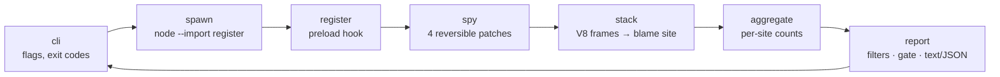

# randspy

[English](README.md) | [中文](README.zh.md) | [日本語](README.ja.md)

[](LICENSE)  [](CHANGELOG.md)  [](CONTRIBUTING.md)

**randspy：オープンソースの Node 非決定性トレーサー——テストに潜む Date.now、Math.random、環境変数、readdir 順序の読み取りを見つけ出し、flaky になる前に該当行をピンポイントで指し示す。**


```bash
git clone https://github.com/JaydenCJ/randspy.git && cd randspy && npm install && npm run build && npm link
```

> プレリリース：v0.1.0 はまだ npm に公開されていないため、上記の手順でソースからインストールしてください。ランタイム依存ゼロ——devDependency は `typescript` のみで、randspy がネットワークに触れることはありません。

## なぜ randspy？

Node の flaky テストの原因は、ほぼ必ず一つの隠れたエントロピー読み取りに行き着きます：スナップショットに焼き込まれた `Date.now()`、アサーションに漏れ出した `Math.random()` の id、手元のマシンと CI で値が異なる `process.env` のフォールバック、あるいはファイルシステム次第で順序が静かに変わる `fs.readdir()`。既存のツールは症状の側を叩くだけです——CI サービスは統計的に疑わしくなるほど flaky になった*後で*テストにフラグを立て、リトライは失敗を覆い隠すだけ。その頃には 50 回に 1 回しか落ちないテストを二分探索する羽目になっています。randspy はこのワークフローを逆転させます：トレーサーの下でスイート（または 1 ファイル）を一度走らせれば、非決定性ソースへのすべての読み取りが、実行した正確な `file:line:column` とともに記録され、呼び出し箇所ごとに集計され、CI に置ける終了コードでゲートされます——赤いビルドを一度も生む*前に*、エントロピーは発見され修正されます。

| | randspy | CI flake 検出器 | テストリトライ | フェイクタイマー |
| --- | --- | --- | --- | --- |
| 検出タイミング | flake が起きる前、1 回の実行で | 統計的な失敗の反復の後 | 決して——失敗は隠される | 対象外（修正手段であり検出器ではない） |
| 該当行の特定 | あり、読み取りごとに `file:line:column` | よくてテスト名まで | なし | なし |
| カバーするエントロピー種別 | 時刻・乱数・環境変数・readdir 順序 | たまたま flaky になったもの | なし | 時刻のみ |
| 先に失敗が必要か | 不要 | 必要、しかも多数 | 必要 | 不要 |
| ランナーとの結合 | 任意の Node スクリプト/ランナー | CI ベンダー連携に依存 | ランナーごとの設定 | ランナーごとの導入 |
| ランタイム依存 | なし | SaaS またはエージェント | ランナーに内蔵 | 1 パッケージ |

<sub>比較は 2026-07 時点の各ツールカテゴリの状況を反映：統計的 flake 検出（CI 分析製品）、主要ランナーの `retry`/`retryTimes` オプション、時計モックライブラリ。フェイクタイマーは時刻エントロピーの正しい*修正手段*であることに変わりはなく——randspy はそれをどこに適用すべきかを教えます。</sub>

## 特長

- **4 種のエントロピーを 1 回の実行で** ——壁時計/単調時計（`Date.now`、引数なし `new Date()`、`performance.now`、`process.hrtime`）、乱数（`Math.random`、node:crypto、Web Crypto）、環境変数 `process.env` の読み取り、ファイルシステムの列挙順序（`fs.readdir*`）。
- **座標付きの特定** ——各読み取りは V8 スタックを辿り、randspy 自身と `node:` 内部を除いた最初のフレームに解決されます；Node が代行する読み取り（`console.log` による `FORCE_COLOR` の参照など）はフィルタされ、あなたのせいにはされません。
- **レポートで終わらないゲート** ——`--fail-on any|none|<categories>` でトレーサーは終了コード 1 の CI チェックになります；`--only`、`--allow`（API 名・パス glob・`file:line`）、`--top` がシグナルをレビュー可能に保ち、レビュー済み箇所は抑制され続けます。
- **セマンティクスを保つパッチ** ——`Date` は Proxy で包まれ、パース・`instanceof`・サブクラス化・明示値でのコンストラクションは無傷のまま；ラッパーはすべて素通しで、`disable()` は元の関数とプロパティ記述子を正確に復元します。
- **決定的で機械可読な出力** ——同一の実行はバイト単位で同一のレポートを描画します；`--format json` は文書化された安定スキーマ（[docs/report-format.md](docs/report-format.md)）に従い、環境変数の*値*は決して記録されず、名前だけが残ります。
- **依存ゼロ・ネットワークゼロ** ——ランタイムは Node 組み込みのみ、子プロセスの preload でプログラム全体をトレースし、テスト内で使えるプログラマティック API（`RandSpy`、`withSpy`）も提供；91 のオフラインテストとエンドツーエンドのスモークスクリプトで検証済み。

## クイックスタート

同梱のエントロピーまみれの例をトレースします：

```bash
randspy run examples/checkout.js
```

実際にキャプチャした出力（order id は実行のたびに変わります——`Math.random` 由来で、それこそがバグです）：

```text
order ord_rlingacf (USD) plugins: audit.js, metrics.js, webhook.js

randspy: 4 nondeterministic read(s) from 4 site(s) — time 1 · random 1 · env 1 · order 1

  RANDOM  ×1  Math.random()         examples/checkout.js:11:26
  TIME    ×1  Date.now()            examples/checkout.js:12:26
  ENV     ×1  process.env.CURRENCY  examples/checkout.js:13:32
  ORDER   ×1  fs.readdirSync()      examples/checkout.js:19:13

  hint(time): freeze the clock — mock timers (node:test, jest, vitest) or an injected now() keep runs reproducible
  hint(random): inject a seeded PRNG, or stub Math.random / crypto in test setup
  hint(env): pass required variables explicitly in test setup instead of reading the ambient environment
  hint(order): sort directory listings before iterating — readdir order is filesystem-dependent

randspy: FAIL — 4 read(s) match fail-on=any
```

リファクタリング後の双子（[examples/deterministic.js](examples/deterministic.js)）は、凍結した時計・シード付き PRNG・明示的な通貨・ソート済みリスターを注入し——結果はグリーンです（実際の出力）：

```text
order ord_ln13h9a6 (USD) plugins: audit.js, metrics.js, webhook.js

randspy: no nondeterministic reads detected

randspy: OK — no nondeterministic reads (fail-on=any)
```

実際のテストのエントリポイントにも同じ方法で向けられます——スクリプト以降の引数はそのまま子プロセスに渡るため `randspy run node_modules/.bin/vitest run` が機能します。出力の多いプログラムでは `--report entropy.json` でレポートを保存し、後で `randspy report` で再描画してください。

## トレース対象カテゴリ

| カテゴリ | トレースする API | 典型的な flake |
| --- | --- | --- |
| `time` | `Date.now()`、引数なし `new Date()`、`Date()`、`performance.now()`、`process.hrtime()` / `.bigint()` | スナップショット内のタイムスタンプ、TTL・経過時間のアサーション |
| `random` | `Math.random()`、`crypto.randomBytes/randomInt/randomUUID/randomFillSync()`、Web Crypto `getRandomValues/randomUUID()` | スナップショット内の生成 id、シードなしプロパティテスト、ジッター |
| `env` | `process.env.NAME` の読み取り、`in` チェック、列挙（`Object.keys`、スプレッド） | マシン間の TZ/LANG/CI 差異；名前のみ記録し、値は決して記録しない |
| `order` | `fs.readdirSync()`、`fs.readdir()`、`fs.promises.readdir()` | 「ディレクトリの最初のファイル」がファイルシステムごとに異なる |

正直な制限：名前付き ESM インポート（`import { readdirSync } from "node:fs"`）はパッチ適用前に束縛されるためトレースできません——デフォルトオブジェクトのインポートと `require()` は可能です；0.1.0 では worker スレッドと孫プロセスは計装されません。詳細は [docs/report-format.md](docs/report-format.md)。

## コマンドラインリファレンス

| フラグ | 既定値 | 効果 |
| --- | --- | --- |
| `--fail-on <gate>` | `any` | 読み取りが一致したら終了コード 1：`any`、`none`、または `time,random` のようなカテゴリ |
| `--only <cats>` | 全部 | レポートとゲートを列挙したカテゴリだけに絞る |
| `--allow <pattern>` | — | API 名・パス glob（`tests/**`）・`file:line`・ファイル名で箇所を抑制；繰り返し指定可 |
| `--format <text\|json>` | `text` | 人間向けレポート、または安定 JSON スキーマ |
| `--top <n>` | 全部 | 最も読み取りの多い n 箇所だけを表示 |
| `--quiet` | オフ | サマリーと判定行だけを表示 |
| `--values` | オフ | 箇所ごとに最大 3 個のプリミティブ戻り値をサンプル（環境変数の値は対象外） |
| `--internals` | オフ | ユーザーコードに届かなかった読み取りを `(node internals)` 付きで保持 |
| `--report <file>` | — | 生の JSON レポートをファイルにも書き出す |

終了コード：`0` はクリーンまたはゲート未発動、`1` はゲート発動、`2` は使い方エラー；トレース対象スクリプトの非ゼロ終了コードはそのまま伝播します。`randspy explain time|random|env|order` は各カテゴリをオフラインで解説します。

## アーキテクチャ



パッチ・スタックパーサー・アグリゲーター・レンダラーは純粋関数で、それぞれ独立にテストされています；プロセス状態に触れるのは CLI と preload フックだけです。このリポジトリは CI を同梱しません——上記の主張はすべて `npm test` と `scripts/smoke.sh` のローカル実行で検証されています。

## ロードマップ

- [x] v0.1.0 ——行単位の特定を伴う 4 種のエントロピー、run/report/explain CLI、allow/only/top フィルタ付き fail-on ゲート、安定 JSON スキーマ、決定的レポート、プログラマティック API、依存ゼロ、91 テスト + スモークスクリプト
- [ ] `worker_threads` とトレース対象プログラムが生成するプロセスのトレース
- [ ] `--freeze` モード：報告するだけでなく、凍結時計とシード付き PRNG を注入
- [ ] モジュールローダーフックで `node:fs` の名前付き ESM インポートもトレース
- [ ] ランナーアダプター：`node:test`、Jest、Vitest レポーター向けのテスト単位の帰属
- [ ] ベースラインファイル：前回承認された実行以降に増えたエントロピーだけをゲート

完全なリストは [open issues](https://github.com/JaydenCJ/randspy/issues) を参照してください。

## コントリビュート

バグ報告（特に帰属先を誤った箇所）、新しいエントロピー源のアイデア、pull request を歓迎します——ローカルのワークフローは [CONTRIBUTING.md](CONTRIBUTING.md)（`npm test` と、`SMOKE OK` を出力する `scripts/smoke.sh`）を参照してください。入門タスクは [good first issue](https://github.com/JaydenCJ/randspy/issues?q=is%3Aissue+is%3Aopen+label%3A%22good+first+issue%22) のラベル付き、設計の議論は [Discussions](https://github.com/JaydenCJ/randspy/discussions) で。

## ライセンス

[MIT](LICENSE)
