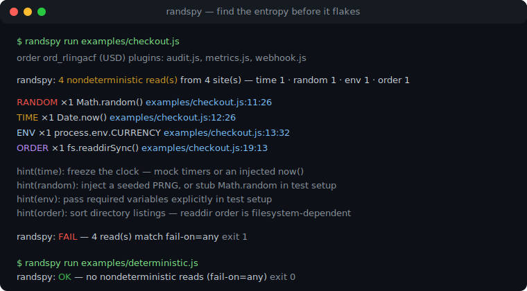
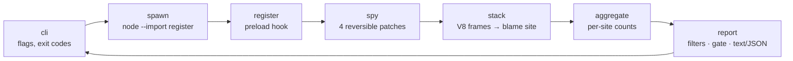

# randspy

[English](README.md) | [中文](README.zh.md) | [日本語](README.ja.md)

[](LICENSE)  [](CHANGELOG.md)  [](CONTRIBUTING.md)

**randspy：an open-source nondeterminism tracer for Node — it finds the stray Date.now, Math.random, env and readdir-order reads hiding in your tests and points at the exact line, before they flake.**



```bash
git clone https://github.com/JaydenCJ/randspy.git && cd randspy && npm install && npm run build && npm link
```

> Pre-release: v0.1.0 is not yet published to npm; install from source as above. Zero runtime dependencies — `typescript` is the only devDependency, and randspy never touches the network.

## Why randspy?

Flaky Node tests almost always trace back to one hidden entropy read: a `Date.now()` baked into a snapshot, a `Math.random()` id leaking into an assertion, a `process.env` fallback that differs between your laptop and CI, or an `fs.readdir()` whose order silently changes with the filesystem. The existing tooling attacks the symptom — CI services flag a test *after* it has flaked enough times to be statistically suspicious, and retries just launder the failure. By then you are bisecting a test that fails one run in fifty. randspy inverts the workflow: run the suite (or a single file) under the tracer once, and every read of a nondeterminism source is recorded with the exact `file:line:column` that performed it, aggregated per site, gated with an exit code you can put in CI — so the entropy is found and fixed *before* it ever produces a red build.

| | randspy | CI flake detectors | test retries | fake timers |
| --- | --- | --- | --- | --- |
| Detection moment | before any flake, on a single run | after repeated statistical failures | never — failures are hidden | n/a (a fix, not a detector) |
| Points at the exact line | yes, `file:line:column` per read | test name at best | no | no |
| Entropy classes covered | time, random, env, readdir order | whatever happens to flake | none | time only |
| Needs failures to happen first | no | yes, many | yes | no |
| Runner coupling | any Node script or runner | CI provider integration | per-runner config | per-runner setup |
| Runtime dependencies | none | SaaS or agent | built into runner | one package |

<sub>Comparison reflects the tool categories as of 2026-07: statistical flake detection (CI analytics products), `retry`/`retryTimes` options in common runners, and clock-mocking libraries. Fake timers remain the right *fix* for time entropy — randspy tells you where to apply them.</sub>

## Features

- **Four entropy categories, one run** — wall/monotonic clocks (`Date.now`, zero-arg `new Date()`, `performance.now`, `process.hrtime`), randomness (`Math.random`, node:crypto, Web Crypto), ambient `process.env` reads, and filesystem iteration order (`fs.readdir*`).
- **Blame with coordinates** — every read resolves through the V8 stack to the first frame outside randspy and outside `node:` internals; reads Node performs on your behalf (like `console.log` probing `FORCE_COLOR`) are filtered out, not blamed on you.
- **A gate, not just a report** — `--fail-on any|none|<categories>` turns the tracer into a CI check with exit code 1; `--only`, `--allow` (API names, path globs, `file:line`) and `--top` keep the signal reviewable, and reviewed sites stay suppressed.
- **Semantics-preserving patches** — `Date` is proxied so parsing, `instanceof`, subclassing and explicit-value construction are untouched; every wrapper is a pass-through and `disable()` restores originals and property descriptors exactly.
- **Deterministic, machine-readable output** — identical runs render byte-identical reports; `--format json` follows a documented stable schema ([docs/report-format.md](docs/report-format.md)), and env variable *values* are never recorded, only names.
- **Zero dependencies, zero network** — pure Node built-ins at runtime, a child-process preload for whole-program tracing, and a programmatic API (`RandSpy`, `withSpy`) for in-test use; verified by 91 offline tests plus an end-to-end smoke script.

## Quickstart

Trace the bundled entropy-ridden example:

```bash
randspy run examples/checkout.js
```

Real captured output (your order id will differ — it comes from `Math.random`, which is exactly the bug):

```text
order ord_rlingacf (USD) plugins: audit.js, metrics.js, webhook.js

randspy: 4 nondeterministic read(s) from 4 site(s) — time 1 · random 1 · env 1 · order 1

  RANDOM  ×1  Math.random()         examples/checkout.js:11:26
  TIME    ×1  Date.now()            examples/checkout.js:12:26
  ENV     ×1  process.env.CURRENCY  examples/checkout.js:13:32
  ORDER   ×1  fs.readdirSync()      examples/checkout.js:19:13

  hint(time): freeze the clock — mock timers (node:test, jest, vitest) or an injected now() keep runs reproducible
  hint(random): inject a seeded PRNG, or stub Math.random / crypto in test setup
  hint(env): pass required variables explicitly in test setup instead of reading the ambient environment
  hint(order): sort directory listings before iterating — readdir order is filesystem-dependent

randspy: FAIL — 4 read(s) match fail-on=any
```

The refactored twin ([examples/deterministic.js](examples/deterministic.js)) injects a frozen clock, a seeded PRNG, an explicit currency and a sorted lister — and comes back green (real output):

```text
order ord_ln13h9a6 (USD) plugins: audit.js, metrics.js, webhook.js

randspy: no nondeterministic reads detected

randspy: OK — no nondeterministic reads (fail-on=any)
```

Point it at your actual test entry the same way — `randspy run node_modules/.bin/vitest run` works because arguments after the script go to the child verbatim. For noisy programs, save the report with `--report entropy.json` and re-render it later with `randspy report`.

## Traced categories

| Category | Traced APIs | Typical flake |
| --- | --- | --- |
| `time` | `Date.now()`, `new Date()` (zero-arg), `Date()`, `performance.now()`, `process.hrtime()` / `.bigint()` | timestamps in snapshots, TTL and elapsed-time assertions |
| `random` | `Math.random()`, `crypto.randomBytes/randomInt/randomUUID/randomFillSync()`, Web Crypto `getRandomValues/randomUUID()` | generated ids in snapshots, unseeded property tests, jitter |
| `env` | `process.env.NAME` reads, `in` checks, enumeration (`Object.keys`, spread) | TZ/LANG/CI differences between machines; names recorded, values never |
| `order` | `fs.readdirSync()`, `fs.readdir()`, `fs.promises.readdir()` | "first file in the directory" differing across filesystems |

Honest limitations: named ESM imports (`import { readdirSync } from "node:fs"`) bind before any patch can land and are not traced — default-object imports and `require()` are; worker threads and grandchild processes are not instrumented in 0.1.0. Details: [docs/report-format.md](docs/report-format.md).

## Command-line reference

| Flag | Default | Effect |
| --- | --- | --- |
| `--fail-on <gate>` | `any` | exit 1 when reads match: `any`, `none`, or categories like `time,random` |
| `--only <cats>` | all | keep only the listed categories in report and gate |
| `--allow <pattern>` | — | suppress sites by API name, path glob (`tests/**`), `file:line` or basename; repeatable |
| `--format <text\|json>` | `text` | human report or the stable JSON schema |
| `--top <n>` | all | show only the n busiest sites |
| `--quiet` | off | print only the summary and verdict lines |
| `--values` | off | sample up to 3 primitive return values per site (never env values) |
| `--internals` | off | keep reads that never reach user code, marked `(node internals)` |
| `--report <file>` | — | additionally write the raw JSON report to a file |

Exit codes: `0` clean or gate not tripped, `1` gate tripped, `2` usage error; a non-zero exit from the traced script is propagated unchanged. `randspy explain time|random|env|order` documents each category offline.

## Architecture



The patches, stack parser, aggregator and renderers are pure and independently tested; only the CLI and the preload hook touch process state. This repository ships no CI — every claim above is verified by local runs of `npm test` and `scripts/smoke.sh`.

## Roadmap

- [x] v0.1.0 — four entropy categories with exact-line blame, run/report/explain CLI, fail-on gate with allow/only/top filters, stable JSON schema, deterministic reports, programmatic API, zero dependencies, 91 tests + smoke script
- [ ] Trace `worker_threads` and processes spawned by the traced program
- [ ] `--freeze` mode: inject a frozen clock and seeded PRNG instead of only reporting
- [ ] Module-loader hook so named ESM imports of `node:fs` are traced too
- [ ] Runner adapters: per-test attribution for `node:test`, Jest and Vitest reporters
- [ ] Baseline files: gate only entropy that is new since the last accepted run

See the [open issues](https://github.com/JaydenCJ/randspy/issues) for the full list.

## Contributing

Bug reports (especially misattributed sites), new entropy-source ideas and pull requests are welcome — see [CONTRIBUTING.md](CONTRIBUTING.md) for the local workflow (`npm test` plus `scripts/smoke.sh` printing `SMOKE OK`). Good entry points are labelled [good first issue](https://github.com/JaydenCJ/randspy/issues?q=is%3Aissue+is%3Aopen+label%3A%22good+first+issue%22), and design questions live in [Discussions](https://github.com/JaydenCJ/randspy/discussions).

## License

[MIT](LICENSE)
