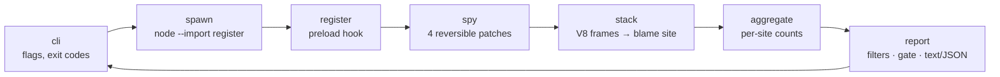

# randspy

[English](README.md) | [中文](README.zh.md) | [日本語](README.ja.md)

[](LICENSE)  [](CHANGELOG.md)  [](CONTRIBUTING.md)

**randspy：开源的 Node 非确定性追踪器——找出藏在测试里的 Date.now、Math.random、环境变量与 readdir 顺序读取，并精确指向那一行，在它们变成 flaky 之前。**


```bash
git clone https://github.com/JaydenCJ/randspy.git && cd randspy && npm install && npm run build && npm link
```

> 预发布：v0.1.0 尚未发布到 npm，请按上面的方式从源码安装。零运行时依赖——`typescript` 是唯一的 devDependency，randspy 从不访问网络。

## 为什么选 randspy？

Node 的 flaky 测试几乎总能追溯到一次隐藏的熵读取：被固化进快照的 `Date.now()`、泄漏进断言的 `Math.random()` id、在你的笔记本和 CI 上取值不同的 `process.env` 回退，或是顺序随文件系统悄然变化的 `fs.readdir()`。现有工具只处理症状——CI 服务要等一个测试 flaky 到足以在统计上可疑*之后*才会标记它，而重试只是把失败洗白。到那时你已经在二分一个五十次才挂一次的测试了。randspy 反转了这个流程：用追踪器跑一遍套件（或单个文件），每一次对非确定性来源的读取都会连同执行它的精确 `file:line:column` 被记录下来，按调用点聚合，并给出可放进 CI 的退出码——在它产生第一个红色构建*之前*，熵就已被找到并修掉。

| | randspy | CI flake 检测器 | 测试重试 | 假计时器 |
| --- | --- | --- | --- | --- |
| 检测时机 | 任何 flake 发生之前，单次运行 | 反复统计性失败之后 | 从不——失败被掩盖 | 不适用（是修复手段，不是检测器） |
| 精确指向行 | 是，每次读取都有 `file:line:column` | 至多到测试名 | 否 | 否 |
| 覆盖的熵类别 | 时间、随机、环境变量、readdir 顺序 | 碰巧 flaky 的那些 | 无 | 仅时间 |
| 需要先出现失败 | 否 | 是，且要很多次 | 是 | 否 |
| 与运行器的耦合 | 任意 Node 脚本或运行器 | 依赖 CI 供应商集成 | 按运行器配置 | 按运行器接入 |
| 运行时依赖 | 无 | SaaS 或 agent | 内建于运行器 | 一个包 |

<sub>对比反映 2026-07 时各工具类别的情况：统计式 flake 检测（CI 分析产品）、常见运行器的 `retry`/`retryTimes` 选项，以及时钟模拟库。假计时器仍是时间熵的正确*修复方式*——randspy 告诉你该在哪里用它。</sub>

## 功能

- **四类熵，一次运行** ——墙钟/单调时钟（`Date.now`、零参 `new Date()`、`performance.now`、`process.hrtime`）、随机性（`Math.random`、node:crypto、Web Crypto）、环境 `process.env` 读取，以及文件系统迭代顺序（`fs.readdir*`）。
- **带坐标的定责** ——每次读取都经由 V8 调用栈解析到 randspy 之外、`node:` 内部之外的第一帧；Node 替你执行的读取（比如 `console.log` 探测 `FORCE_COLOR`）会被过滤，不会算在你头上。
- **是门禁，不只是报告** ——`--fail-on any|none|<categories>` 把追踪器变成退出码为 1 的 CI 检查；`--only`、`--allow`（API 名、路径 glob、`file:line`）与 `--top` 让信号保持可审阅，审阅过的调用点持续被抑制。
- **保语义的补丁** ——`Date` 通过 Proxy 代理，解析、`instanceof`、子类化与显式取值构造完全不受影响；每个包装器都是纯透传，`disable()` 会精确还原原函数与属性描述符。
- **确定性的机器可读输出** ——相同的运行渲染出逐字节相同的报告；`--format json` 遵循文档化的稳定 schema（[docs/report-format.md](docs/report-format.md)），且环境变量的*值*从不被记录，只记录名字。
- **零依赖、零网络** ——运行时只用 Node 内建模块，通过子进程 preload 实现全程序追踪，并提供程序化 API（`RandSpy`、`withSpy`）供测试内使用；由 91 个离线测试加端到端冒烟脚本验证。

## 快速上手

追踪自带的充满熵的示例：

```bash
randspy run examples/checkout.js
```

真实捕获的输出（你的 order id 会不一样——它来自 `Math.random`，这正是问题所在）：

```text
order ord_rlingacf (USD) plugins: audit.js, metrics.js, webhook.js

randspy: 4 nondeterministic read(s) from 4 site(s) — time 1 · random 1 · env 1 · order 1

  RANDOM  ×1  Math.random()         examples/checkout.js:11:26
  TIME    ×1  Date.now()            examples/checkout.js:12:26
  ENV     ×1  process.env.CURRENCY  examples/checkout.js:13:32
  ORDER   ×1  fs.readdirSync()      examples/checkout.js:19:13

  hint(time): freeze the clock — mock timers (node:test, jest, vitest) or an injected now() keep runs reproducible
  hint(random): inject a seeded PRNG, or stub Math.random / crypto in test setup
  hint(env): pass required variables explicitly in test setup instead of reading the ambient environment
  hint(order): sort directory listings before iterating — readdir order is filesystem-dependent

randspy: FAIL — 4 read(s) match fail-on=any
```

重构后的孪生版本（[examples/deterministic.js](examples/deterministic.js)）注入了冻结时钟、有种子的 PRNG、显式货币与排序后的列举器——结果全绿（真实输出）：

```text
order ord_ln13h9a6 (USD) plugins: audit.js, metrics.js, webhook.js

randspy: no nondeterministic reads detected

randspy: OK — no nondeterministic reads (fail-on=any)
```

用同样的方式指向你真正的测试入口——`randspy run node_modules/.bin/vitest run` 可以工作，因为脚本之后的参数会原样传给子进程。对输出嘈杂的程序，用 `--report entropy.json` 保存报告，之后再用 `randspy report` 重新渲染。

## 追踪的类别

| 类别 | 追踪的 API | 典型 flake |
| --- | --- | --- |
| `time` | `Date.now()`、零参 `new Date()`、`Date()`、`performance.now()`、`process.hrtime()` / `.bigint()` | 快照里的时间戳、TTL 与耗时断言 |
| `random` | `Math.random()`、`crypto.randomBytes/randomInt/randomUUID/randomFillSync()`、Web Crypto `getRandomValues/randomUUID()` | 快照里的生成 id、无种子的属性测试、抖动 |
| `env` | `process.env.NAME` 读取、`in` 检查、枚举（`Object.keys`、展开） | 机器之间的 TZ/LANG/CI 差异；只记录名字，从不记录值 |
| `order` | `fs.readdirSync()`、`fs.readdir()`、`fs.promises.readdir()` | "目录里的第一个文件"随文件系统而不同 |

诚实的局限：具名 ESM 导入（`import { readdirSync } from "node:fs"`）在任何补丁生效之前就已绑定，无法被追踪——默认对象导入与 `require()` 可以；0.1.0 尚未对 worker 线程与孙进程做插桩。详情见 [docs/report-format.md](docs/report-format.md)。

## 命令行参考

| 选项 | 默认 | 效果 |
| --- | --- | --- |
| `--fail-on <gate>` | `any` | 读取命中时退出 1：`any`、`none`，或 `time,random` 这样的类别 |
| `--only <cats>` | 全部 | 报告与门禁只保留列出的类别 |
| `--allow <pattern>` | — | 按 API 名、路径 glob（`tests/**`）、`file:line` 或文件名抑制调用点；可重复 |
| `--format <text\|json>` | `text` | 人类可读报告，或稳定的 JSON schema |
| `--top <n>` | 全部 | 只显示最繁忙的 n 个调用点 |
| `--quiet` | 关 | 只打印摘要与判定行 |
| `--values` | 关 | 每个调用点最多采样 3 个原始类型返回值（从不采样环境值） |
| `--internals` | 关 | 保留从未到达用户代码的读取，标记为 `(node internals)` |
| `--report <file>` | — | 额外把原始 JSON 报告写入文件 |

退出码：`0` 干净或门禁未触发，`1` 门禁触发，`2` 用法错误；被追踪脚本的非零退出码原样传播。`randspy explain time|random|env|order` 离线解释每个类别。

## 架构



补丁、栈解析器、聚合器与渲染器都是纯函数并独立测试；只有 CLI 和 preload 钩子接触进程状态。本仓库不携带 CI——上面的每一条声明都由本地运行 `npm test` 与 `scripts/smoke.sh` 验证。

## 路线图

- [x] v0.1.0 ——四类熵与精确到行的定责、run/report/explain CLI、带 allow/only/top 过滤的 fail-on 门禁、稳定 JSON schema、确定性报告、程序化 API、零依赖、91 个测试 + 冒烟脚本
- [ ] 追踪 `worker_threads` 与被追踪程序派生的进程
- [ ] `--freeze` 模式：注入冻结时钟与有种子的 PRNG，而不只是报告
- [ ] 模块加载器钩子，让 `node:fs` 的具名 ESM 导入也能被追踪
- [ ] 运行器适配：为 `node:test`、Jest 与 Vitest 报告器提供按测试的归因
- [ ] 基线文件：只对自上次接受的运行以来新增的熵设门禁

完整列表见 [open issues](https://github.com/JaydenCJ/randspy/issues)。

## 贡献

欢迎 bug 报告（尤其是定责错误的调用点）、新熵源的想法与 pull request——本地工作流见 [CONTRIBUTING.md](CONTRIBUTING.md)（`npm test` 加上打印 `SMOKE OK` 的 `scripts/smoke.sh`）。入门任务标记为 [good first issue](https://github.com/JaydenCJ/randspy/issues?q=is%3Aissue+is%3Aopen+label%3A%22good+first+issue%22)，设计讨论在 [Discussions](https://github.com/JaydenCJ/randspy/discussions)。

## 许可证

[MIT](LICENSE)
